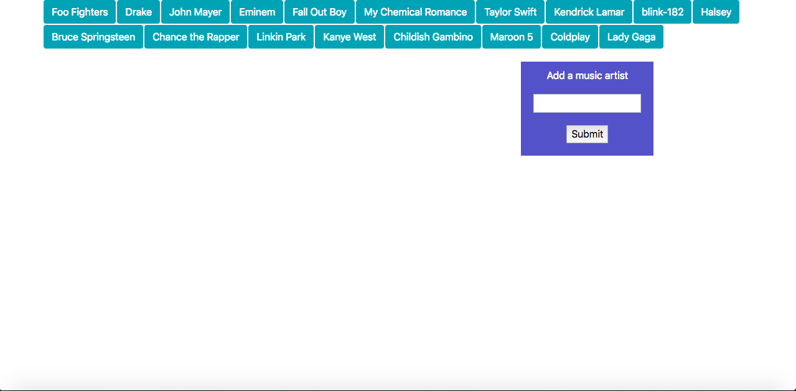

# GifTastic

## Overview

In this homework assignment for Rutgers Coding Bootcamp, students were asked to use the GIPHY API to make a dynamic web page that populates with gifs of their choice. To finish this task, the students must call the GIPHY API and use JavaScript and jQuery to change the HTML of their site.

## Screenshots
Home page

blink-182 gifs

Childish Gambino gifs

Taylor Swift gifs

